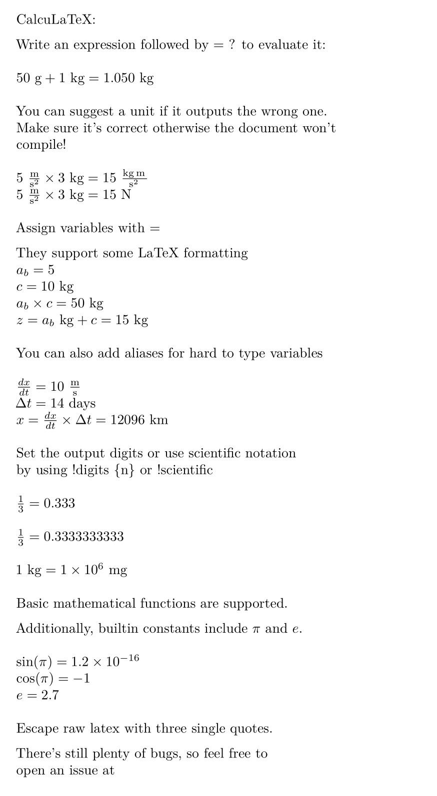

# CalcuLaTeX


Try it out at <https://mkhan45.github.io/CalcuLaTeX-Web/>

## Example

```
'''
Given a rock with mass $m_{rock}$ thrown by a force of $F_0$ acting over a duration $dt_{force}$,
calculate its airtime and the max height it achieves.
'''

''' Given: '''
g = 9.81 m/s^2
m_{rock} = 10 kg
F_0 = 1000 N
dt_{force} = 0.1 s


''' Solution: '''
y_{vel} = F_0 / m_{rock} * dt_{force} = ?

airtime = y_{vel} / g * 2 = ?
height_{max} = y_{vel} * airtime / 4 = ? cm
```

Outputs:


```
''' 
CalcuLaTeX:

Write an expression followed by = ? to evaluate it:
'''

50 g + 1 kg = ?

'''
You can suggest a unit if it outputs the wrong one. \\
Make sure it's correct otherwise the document won't \\
compile!
'''

5 m/s^2 * 3 kg = ?
5 m/s^2 * 3 kg = ? N

'''
Assign variables with =
'''
x = 5
y = 10 kg
x * y = ?
z = x kg + y = ?

'''
Set the output digits or use scientific notation \\
by using !digits \{n\} or !scientific 
'''

1 / 3 = ?

!digits 10
1 / 3 = ?

!digits 1
!scientific
1 kg = ? mg

'''
Escape raw latex with three single quotes.

There's still plenty of bugs, so feel free to \\
open an issue at \\
https://github.com/mkhan45/CalcuLaTeX
'''
```

Outputs:



___

# CLI Usage

Assuming the binary is called `calculatex`, running `calculatex [input] [output.pdf]` will watch the `input` file and output to `output.pdf` on change. This is meant for use with a PDF viewer which updates in realtime.

To run the CalcuLaTeX cli, you'll also need pandoc and a texlive installation.

___

# Compiling

To build CalcuLaTeX, you need a nightly Rust compiler and Cargo, preferably through rustup. After that, it's as simple as:

```
git clone git@github.com:mkhan45/CalcuLaTeX.git
cd CalcuLaTeX

# both of these output to target/release/
cargo build --release # builds the library only
cargo build --features build-binary --release # builds the CLI
```

___

# Contributing

If you'd like to contribute, feel free to open an issue or send me an email. The code base is very messy right now but it's small enough to be pretty understandable. Performance suggestions are welcome, but only if they don't introduce any extra complexity. I haven't benchmarked anything but LaTeX compilation is pretty much guaranteed to take an order of magnitude longer than the interpreter.

For guidelines, read [CONTRIBUTING.md](CONTRIBUTING.md)
